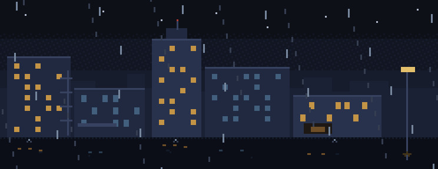

Design and HCI at Stanford.

I build product interfaces and small audio tools.

- [Story soundboard](https://github.com/neevseedani/story-soundboard) — click or speak a cue; play a clip through a Bluetooth phone.

Currently: karaoke from generated music.
